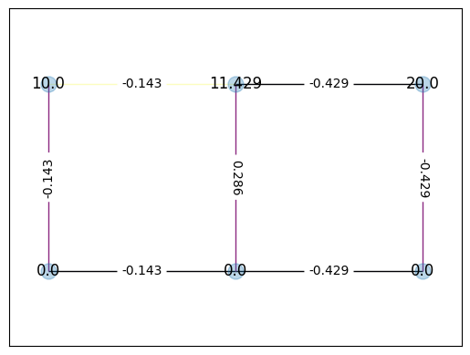

# Electric Circuit Solver using Mesh Analysis

This Python project aims to solve electric circuits using mesh analysis, a common technique used in electrical engineering to analyze complex circuits with multiple loops or meshes. The solver leverages principles of graph theory, object-oriented programming, and linear algebra to efficiently compute the currents flowing through each mesh in the circuit.



## Features

- Mesh analysis implementation to solve resistor circuits.
- Object-oriented approach for representing nodes, edges, and the circuit graph.
- Visualization capabilities for circuit graphs.
- Ability to handle circuits with any number of nodes and edges.

## Requirements

- Python 3.11
- NumPy
- SciPy
- NetworkX
- Matplotlib

## Usage

To use the electric circuit solver, follow these steps:

1. Clone the repository to your local machine.
2. Install the required dependencies using pip (yet to be implemented):

```
pip install -r requirements.txt
```

3. Create a Python script or Jupyter Notebook to define your circuit topology and resistor values.
4. Import the necessary classes and functions from the `circuit_solver` module.
5. Define the nodes, edges, and resistor values for your circuit.
6. Create a `Circuit` object with the provided nodes and edges.
7. Call the `solve()` method of the `Circuit` object to compute the currents through each mesh.
8. Visualize the circuit graph and the computed currents using the provided plotting functions.

## Example

Here's a simple example of how to use the electric circuit solver:

```python
from circuit_solver import Node, Edge, Nodes, Edges, Circuit
from analysis import draw
import matplotlib.pyplot as plt

# Define the nodes
n0 = Node()
n1 = Node()
n2 = Node()
n3 = Node()

# Define the edges (resistors)
e0 = Edge(n0, n1, resistance=10)
e1 = Edge(n1, n2, resistance=20)
e2 = Edge(n2, n3, resistance=15)
e3 = Edge(n3, n0, resistance=12)
e4 = Edge(n2, n0, resistance=8)

# Create the circuit
circuit = Circuit(Nodes(n0, n1, n2, n3), Edges(e0, e1, e2, e3, e4))

# Solve the circuit
circuit.solve()

# Visualize the circuit and currents
draw(circuit)
plt.show()
```

## Contributing

Contributions to this project are welcome! If you encounter any bugs or have suggestions for improvements, please open an issue on GitHub or submit a pull request with your changes.

## License

This project is licensed under the MIT License. See the [LICENSE](LICENSE) file for details.
