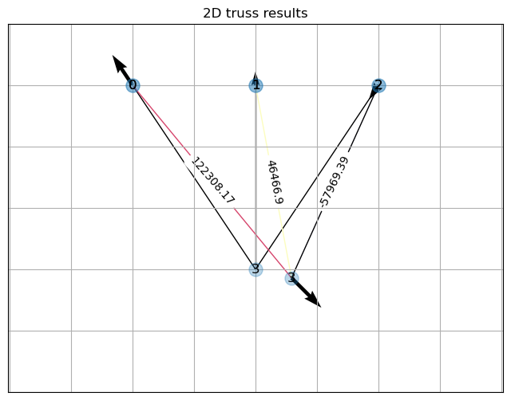

# 2D Truss Solver

## Introduction
Welcome to the 2D Truss Solver repository! This Python script offers a powerful computational tool for analyzing 2D truss structures, aiding engineers in understanding their behavior under various loading conditions. Leveraging object-oriented programming principles, efficient numerical methods, and visualization capabilities, this script provides a versatile solution for structural analysis.

## Features
- **Object-Oriented Design:** Structured around classes representing joints, members, and truss, promoting modularity and code reusability.
- **Easy Setup:** Intuitive setup process allowing users to define truss geometry, apply loads, and constraints effortlessly.
- **Efficient Solver:** Utilizes numerical methods to accurately determine internal forces and displacements within the truss.
- **Visualization Capabilities:** Generates clear and informative plots illustrating the deformed shape, internal forces, and reactions within the truss.
- **Flexibility and Extensibility:** Easily customizable parameters for material properties, section properties, and loading conditions, catering to diverse engineering requirements.

## Next Steps
- **Refinement and Validation:** Continual refinement and validation against analytical solutions or experimental data to ensure accuracy and reliability.
- **Optimization and Performance Enhancement:** Enhance efficiency and performance through algorithmic improvements and optimization techniques.
- **Extension to Frames:** Extend capabilities to analyze 2D frames, incorporating bending moments and shear forces.
- **Development of 3D Structural Analysis:** Transition to analyzing 3D trusses and frames, handling spatial relationships and additional complexities.
- **User Interface Development:** Develop a graphical user interface for enhanced usability and accessibility.
- **Collaborative Development and Community Engagement:** Foster collaboration and community engagement to drive continuous improvement and innovation.

## Usage
1. (WIP) Clone the repository: `git clone https://github.com/username/2d-truss-solver.git`
2. (WIP) Install dependencies: `pip install -r requirements.txt`
3. Run the script: `python truss_solver.py`
4. Follow on-screen prompts to define truss geometry, apply loads, and visualize results.

## Contributions
Contributions, feedback, and suggestions are welcome! Feel free to fork the repository, make enhancements, and submit pull requests.

## License
This project is licensed under the [MIT License](LICENSE).
